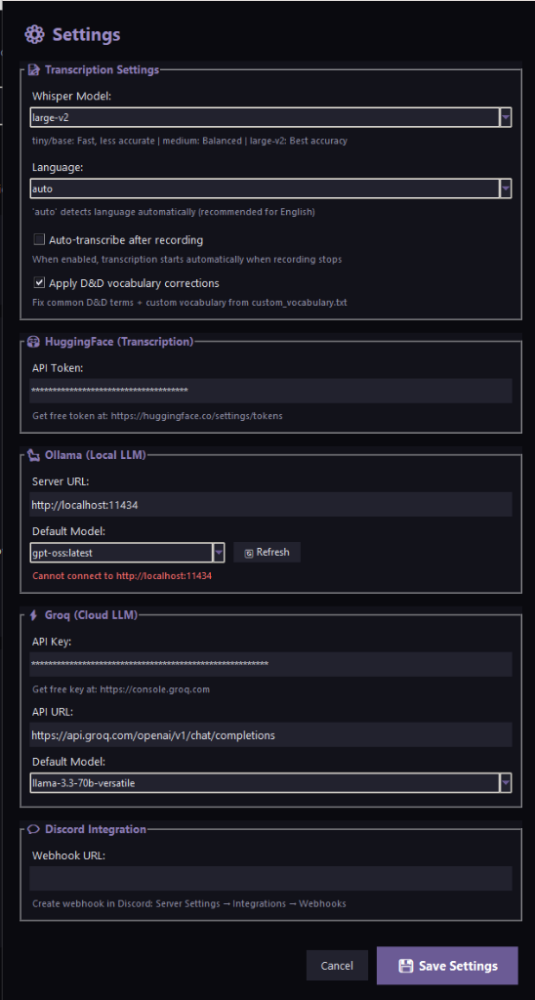

# THE KRAKEN DREAMS 🐙

## D&D Session Transcription & Narrative Suite

A desktop application for transcribing and transforming your tabletop RPG sessions into narrative stories using AI.

**Version:** 1.5.0 | **License:** MIT | **Platform:** Windows, Linux, macOS

[](https://opensource.org/licenses/MIT)

---

## 🖼️ Screenshots

### Transcription & Speaker Management
| Transcribe Tab | Speakers Tab |
|:--------------:|:------------:|
|  |  |

### Preview & AI Story Generation
| Preview Tab | Bard's Tale |
|:-----------:|:-----------:|
|  |  |

### Configuration
| Settings Dialog |
|:---------------:|
|  |

---

## ✨ Features

### 🎬 Workflow (OBS Integration)
The app is designed to work seamlessly with [OBS Studio](https://obsproject.com/) recordings. Reliability is key: record your session with OBS, then drag the file into The Kraken to begin magic.

### 📝 Transcription
- **WhisperX integration** - Fast, accurate speech-to-text with word-level timestamps.
- **Speaker diarization** - Automatically identifies unique speakers (Voice 1, Voice 2...).
- **Model selection** - Choose speed vs. accuracy (tiny → large-v2).
- **Language options** - Force specific language or auto-detect.
- **D&D vocabulary** - Automatic correction for common fantasy terms (initiative, dexterity, etc.).

### 👥 Speaker Management
- **VLC-Powered Playback** - Instant seeking and smooth video playback.
- **Visual Identification** - Syncs with video so you can *see* who is talking (e.g., Discord overlay).
- **Assign Names** - Replace "SPEAKER_01" with character names effortlessly.
- **Avatar Support** - Assign character portraits to speakers for a visual interface.
- **Color Coding** - Each speaker gets a unique color for readability.

### 📖 Bard's Tale (AI Narratives)
- **Transform Transcripts** - Turn raw session logs into flowing prose stories.
- **Narrative Styles** - Epic Fantasy, Tavern Tale, Dramatic Chronicle, and more.
- **LLM Options** - Use **Ollama** (free, local) or **Groq** (cloud, ultra-fast).
- **Session Summaries** - Generate short, Discord-ready recaps with one click.
- **The Party** - Automatically populated character roster based on your transcript.

### 💬 Integrations
- **Discord Webhook** - Post summaries directly to your campaign channel.
- **Export Options** - TXT, Markdown, HTML.
- **Full-Text Search** - Search across all your past session transcripts instantly.

---

## 📋 Requirements

### Hardware
| Component | Minimum | Recommended |
|-----------|---------|-------------|
| **GPU** | - | **NVIDIA 8GB+ VRAM** (Critical for reasonable speed) |
| **RAM** | 8GB | 16GB+ |
| **Storage** | 5GB | 10GB+ |

> **Note:** Transcription works on CPU but is *significantly* slower. A 4-hour session might take 1 hour on GPU, but 10+ hours on CPU.

### Software
- **OS**: Windows 10/11 (Preferred), Linux, or macOS.
- **Python**: 3.10 - 3.12.
- **VLC Media Player**: Required for audio/video playback engine. [Download VLC](https://www.videolan.org/vlc/).
- **FFmpeg**: Required for audio extraction.
- **OBS Studio**: Recommended for recording.

---

## 🚀 Quick Start Guide

### 1. Install System Dependencies

<details>
<summary><b>🪟 Windows Setup</b></summary>

1. **Install FFmpeg**
   ```powershell
   winget install ffmpeg
   ```
2. **Install VLC Media Player**
   - Download from [videolan.org](https://www.videolan.org/vlc/) or run `winget install VideoLAN.VLC`.
3. **Install Python Requirements**
   ```powershell
   # 1. Install PyTorch with CUDA (for NVIDIA GPUs)
   pip install torch==2.5.1 torchvision==0.20.1 torchaudio==2.5.1 --index-url https://download.pytorch.org/whl/cu121

   # 2. Install WhisperX
   pip install git+https://github.com/m-bain/whisperx.git

   # 3. Install App Dependencies from the project folder
   pip install -r requirements.txt
   ```
</details>

<details>
<summary><b>🐧 Linux Setup</b></summary>

```bash
# 1. System packages
sudo apt update
sudo apt install ffmpeg vlc python3-tk python3-pip

# 2. PyTorch with CUDA
pip install torch torchvision torchaudio --index-url https://download.pytorch.org/whl/cu121

# 3. WhisperX
pip install git+https://github.com/m-bain/whisperx.git

# 4. App Dependencies
pip install -r requirements.txt
```
</details>

### 2. Get Your API Tokens

#### A. HuggingFace Token (For Speaker Identification)
*Required for the Pyannote AI model that distinguishes between different voices.*
1. Create an account at [huggingface.co](https://huggingface.co/join).
2. Visit and accept the user conditions for these two models:
   - [pyannote/segmentation-3.0](https://huggingface.co/pyannote/segmentation-3.0)
   - [pyannote/speaker-diarization-3.1](https://huggingface.co/pyannote/speaker-diarization-3.1)
3. Go to [Settings → Tokens](https://huggingface.co/settings/tokens).
4. Create a new token (Type: **Read**).
5. Copy this token—you will paste it into the app's settings.

#### B. LLM Provider (For Bard's Tale Stories)
*Choose one of the following:*
*   **Ollama (Local, Free, Private):**
    1. Download from [ollama.ai](https://ollama.ai).
    2. Run `ollama pull llama3` (or your preferred model) in terminal.
    3. The app connects automatically.
*   **Groq (Cloud, Fast, Free Tier):**
    1. Get an API Key from [console.groq.com](https://console.groq.com).
    2. Paste the key into the app's settings.

### 3. Run The Kraken

```bash
python kraken_suite.py
```

---

## 📁 Project Structure

```
The-Kraken-Dreams/
├── kraken_suite.py          # Main application entry point
├── requirements.txt         # Python dependencies
├── src/                     # Source code modules
│   ├── core/                # Backend logic (AI, config, narrative)
│   └── ui/                  # Frontend components (Tabs, Widgets)
├── screenshots/             # Images for README
├── transcripts/             # Exported transcripts (auto-generated)
└── avatars/                 # Character portraits (auto-generated)
```

### Avatars Folder
Place character images in the `avatars/` folder.
- **Privacy:** This folder is ignored by git (`.gitignore`), so your personal campaign art stays private.
- **Usage:** Click the empty circle in the "Speakers" tab to assign an image to a voice.

---

## 🔧 Troubleshooting Common Issues

| Issue | Solution |
|-------|----------|
| **"VLC not found"** | Install VLC Media Player. If installed, ensure it matches your Python bit-version (usually 64-bit). |
| **"No module named whisperx"** | Run the git install command: `pip install git+https://github.com/m-bain/whisperx.git` |
| **Playback is silent** | Check that your system audio isn't muted and VLC volume is up. |
| **"CUDA not available"** | You are running on CPU mode. Reinstall PyTorch with the specific CUDA index URL. |

---

## 🤝 Contributing

Contributions are welcome! Please ensure you:
1. **Test Locally:** Verify that transcription and playback work.
2. **Lint:** Keep code clean and readable.
3. **Ignore Secrets:** Never commit `kraken_config.json` or `.env` files containing API keys.

---

## 📜 License

[MIT License](LICENSE) - Free to use, modify, and distribute.

*Release the Kraken! 🐙*
