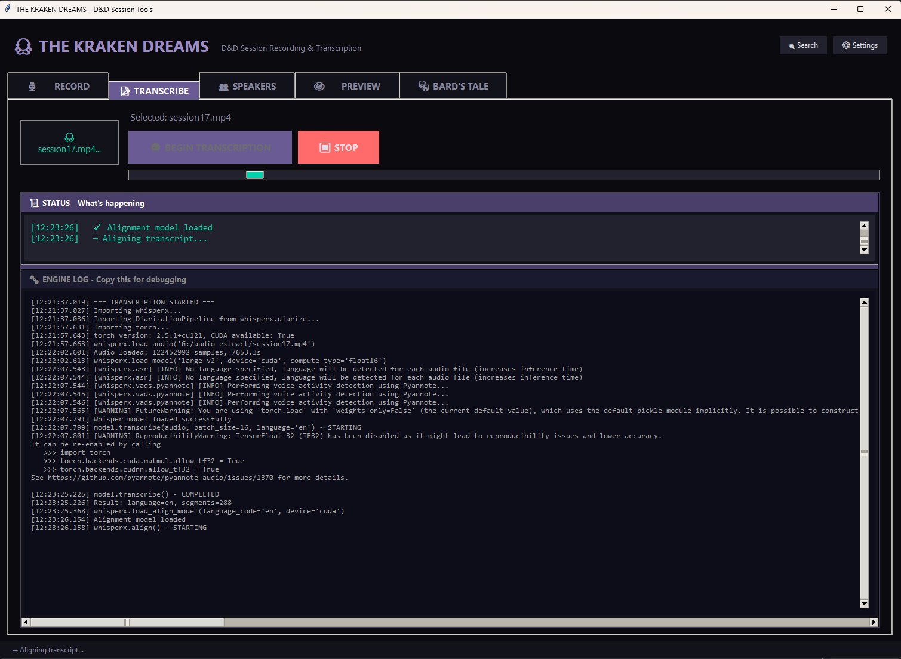
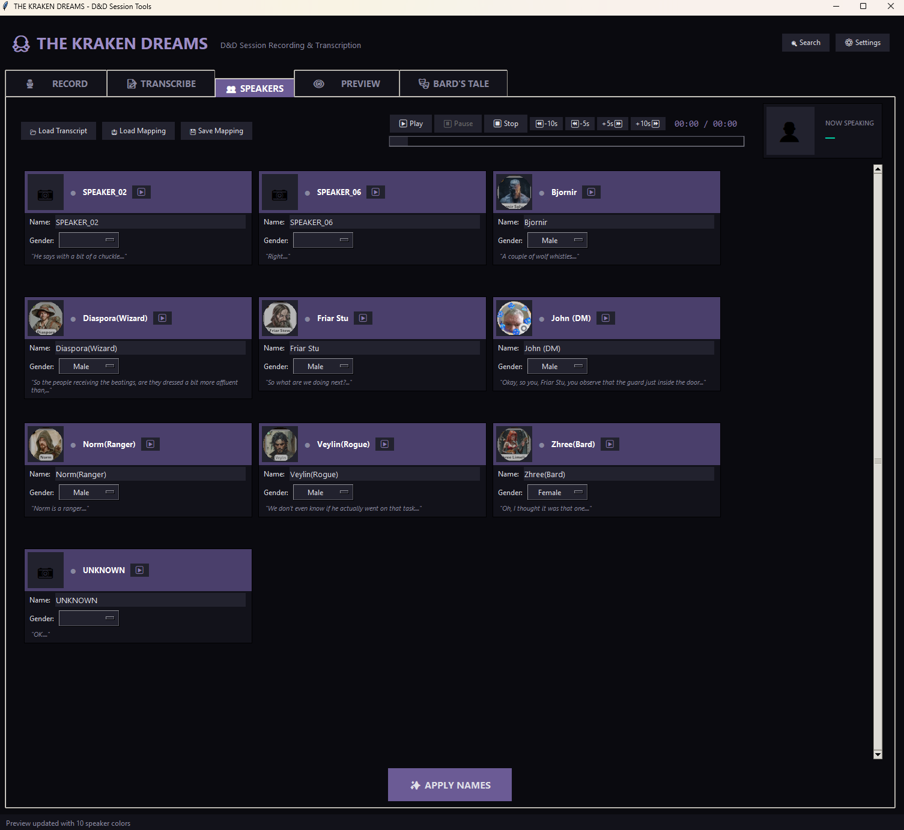
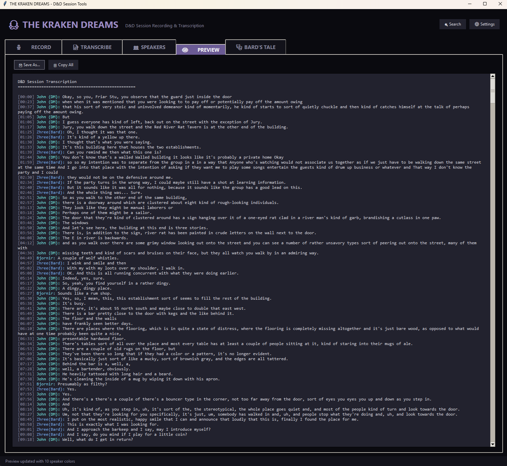
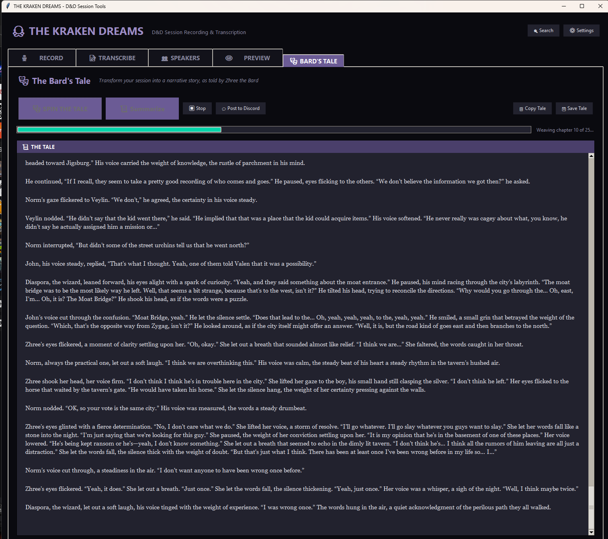
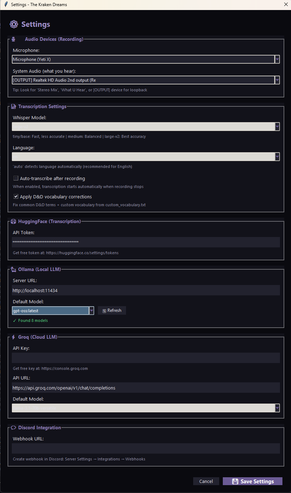

# THE KRAKEN DREAMS 🐙

## D&D Session Transcription & Narrative Suite

A desktop application for transcribing and transforming your tabletop RPG sessions into narrative stories.

**Version:** 1.4.0 | **License:** MIT | **Platform:** Windows, Linux, macOS

[](https://opensource.org/licenses/MIT)


---

## 🖼️ Screenshots

### Transcription & Speaker Management
| Transcribe Tab | Speakers Tab |
|:--------------:|:------------:|
|  |  |

### Preview & AI Story Generation
| Preview Tab | Bard's Tale |
|:-----------:|:-----------:|
|  |  |

### Configuration
| Settings Dialog |
|:---------------:|
|  |

---

## ✨ Features

### 🎬 Recording (via OBS Studio)
The app includes a guide for recording your sessions with [OBS Studio](https://obsproject.com/) (free), which reliably captures both your microphone and system audio (Discord). After recording, simply drag your file into the Transcribe tab.

### 📝 Transcription
- **WhisperX integration** - Fast, accurate speech-to-text
- **Speaker diarization** - Automatically identify who said what
- **Model selection** - Choose speed vs. accuracy (tiny → large-v2)
- **Language options** - Force specific language or auto-detect
- **D&D vocabulary** - Built-in corrections for fantasy terms
- **Punctuation improvements** - Better sentence boundaries

### 👥 Speaker Management
- **Assign names** - Replace "SPEAKER_01" with character names
- **Gender selection** - Helps AI use correct pronouns
- **Avatar support** - Assign character portraits to speakers
- **Color coding** - Each speaker gets a unique color
- **Save/load mappings** - Reuse speaker assignments across sessions

### 📖 Bard's Tale (AI Narratives)
- **Transform transcripts** - Turn session logs into prose stories
- **Multiple styles** - Epic Fantasy, Tavern Tale, Dramatic Chronicle, and more
- **LLM options** - Ollama (local) or Groq (cloud, free tier)
- **Session summaries** - Short, Discord-ready recaps
- **Character avatars** - Party portraits displayed in UI

### 💬 Integrations
- **Discord webhook** - Post summaries directly to Discord
- **Obsidian export** - Wikilinks and YAML frontmatter
- **Multiple formats** - TXT, Markdown, HTML export
- **Full-text search** - Search across all transcripts (Ctrl+F)

### 🗃️ Campaign Management
- **Session database** - SQLite storage for campaigns
- **Campaign tracker** - Link sessions, characters, locations
- **Persistent settings** - Remembers window position and preferences

---

## ⌨️ Keyboard Shortcuts

| Key | Action |
|-----|--------|
| **Ctrl+T** | Begin Transcription |
| **Ctrl+S** | Save Transcript |
| **Ctrl+F** | Search All Transcripts |

---

## 📋 Requirements

### Hardware
| Component | Minimum | Recommended |
|-----------|---------|-------------|
| GPU | - | NVIDIA 8GB+ VRAM |
| RAM | 8GB | 16GB+ |
| Storage | 5GB | 10GB+ |

> Note: Transcription works on CPU but is significantly slower.

### Software
- **Windows 10/11**, **Linux**, or **macOS**
- Python 3.10-3.12
- FFmpeg
- NVIDIA CUDA Toolkit (optional, for GPU acceleration)
- [OBS Studio](https://obsproject.com/) (for recording sessions)


---

## 🚀 Quick Start

### 1. Install Dependencies

<details>
<summary><b>🪟 Windows</b></summary>

```bash
# Install FFmpeg
winget install ffmpeg

# Install PyTorch with CUDA (GPU)
pip install torch==2.5.1 torchvision==0.20.1 torchaudio==2.5.1 --index-url https://download.pytorch.org/whl/cu121

# Install WhisperX
pip install git+https://github.com/m-bain/whisperx.git

# Install other dependencies
pip install -r requirements.txt
```
</details>

<details>
<summary><b>🐧 Linux (Ubuntu/Debian)</b></summary>

```bash
# Install system dependencies
sudo apt update
sudo apt install ffmpeg python3-tk python3-pip

# Install PyTorch with CUDA (GPU)
pip install torch torchvision torchaudio --index-url https://download.pytorch.org/whl/cu121

# Install WhisperX
pip install git+https://github.com/m-bain/whisperx.git

# Install other dependencies
pip install -r requirements.txt
```
</details>

<details>
<summary><b>🍎 macOS</b></summary>

```bash
# Install FFmpeg
brew install ffmpeg

# Install PyTorch
pip install torch torchvision torchaudio

# Install WhisperX
pip install git+https://github.com/m-bain/whisperx.git

# Install other dependencies
pip install -r requirements.txt
```
</details>


### 2. Get HuggingFace Token

1. Create account at [huggingface.co](https://huggingface.co/join)
2. Accept model licenses:
   - [pyannote/segmentation-3.0](https://huggingface.co/pyannote/segmentation-3.0)
   - [pyannote/speaker-diarization-3.1](https://huggingface.co/pyannote/speaker-diarization-3.1)
3. Create token at [Settings → Tokens](https://huggingface.co/settings/tokens)
4. Enter token in app Settings

### 3. Run the App

```bash
python kraken_suite.py
```

---

## 🎬 Recording Your Sessions

This app does **not** include built-in recording. Use [OBS Studio](https://obsproject.com/) (free) to capture your sessions:

1. **Download OBS** from [obsproject.com](https://obsproject.com/download)
2. **Configure audio sources:**
   - Desktop Audio → Your speakers/headphones (captures Discord)
   - Mic/Auxiliary Audio → Your microphone
3. **Set output format** to MP4 or MKV (Settings → Output)
4. **Click "Start Recording"** when your session begins
5. **Drag the recorded file** into The Kraken Dreams' Transcribe tab

> The Record tab in the app provides detailed setup instructions.

---

## 📁 Project Structure

```
The-Kraken-Dreams/
├── kraken_suite.py          # Main application
├── requirements.txt         # Python dependencies
├── src/                     # Source modules
│   ├── core/                # Core functionality
│   └── ui/                  # UI components
├── docs/                    # Documentation
│   └── HOW_TO.md           # Quick-start guide
├── screenshots/             # Application screenshots
├── transcripts/             # Transcript files (gitignored)
└── avatars/                 # Character images - see below
```

### Avatars Folder

The `avatars/` folder is where you store character portraits:

- **Not tracked in git** - Your personal character images stay private
- **Supported formats** - PNG, JPG, GIF
- **Recommended size** - 100x100 to 200x200 pixels
- **How to use** - Click the avatar circle in the Speakers tab to assign images

Store player character portraits, NPC images, or any artwork you want associated with speakers in your transcripts.

---

## 📚 Documentation

| Document | Description |
|----------|-------------|
| [HOW_TO.md](docs/HOW_TO.md) | Quick-start guide |
| [KRAKEN_README.md](KRAKEN_README.md) | Full user manual |
| [CHANGELOG.md](CHANGELOG.md) | Version history |
| [TODO.md](TODO.md) | Roadmap |
| [BUGS.md](BUGS.md) | Known issues |

---

## 🔧 Troubleshooting

| Issue | Solution |
|-------|----------|
| "No module named 'whisperx'" | `pip install git+https://github.com/m-bain/whisperx.git` |
| "CUDA not available" | Reinstall PyTorch with CUDA (see Quick Start) |
| Drag-drop not working | `pip install tkinterdnd2` |
| Settings too tall | Scroll down - the dialog is scrollable |

---

## 🤝 Contributing

Contributions welcome! See [TODO.md](TODO.md) for planned features.

- Report bugs via GitHub Issues
- Submit pull requests
- Suggest new narrative styles for Bard's Tale

---

## 🙏 Acknowledgments

- [WhisperX](https://github.com/m-bain/whisperx) - Fast transcription
- [Pyannote](https://github.com/pyannote/pyannote-audio) - Speaker diarization
- [Ollama](https://ollama.ai/) - Local LLM inference
- [Groq](https://groq.com/) - Cloud LLM inference
- [OBS Studio](https://obsproject.com/) - Session recording

---

## 📜 License

MIT License - See [LICENSE](LICENSE) for details.

*Release the Kraken! 🐙*
